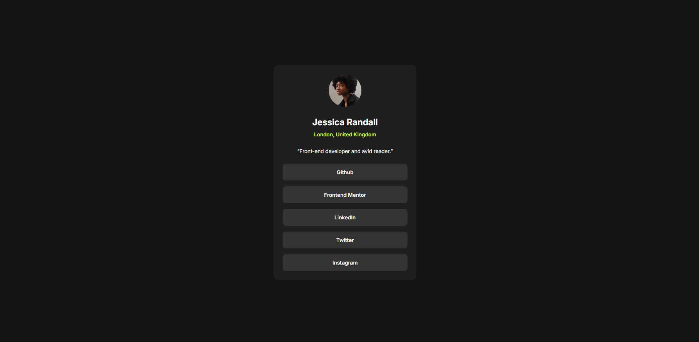

# Frontend Mentor - Social links profile solution

This is a solution to the [Social links profile challenge on Frontend Mentor](https://www.frontendmentor.io/challenges/social-links-profile-UG32l9m6dQ). Frontend Mentor challenges help you improve your coding skills by building realistic projects.

## Table of contents

- [Overview](#overview)
  - [The challenge](#the-challenge)
  - [Screenshot](#screenshot)
  - [Links](#links)
- [My process](#my-process)
  - [Built with](#built-with)
  - [What I learned](#what-i-learned)
  - [Continued development](#continued-development)
  - [Useful resources](#useful-resources)
- [Author](#author)

## Overview

### The challenge

Users should be able to:

- See hover and focus states for all interactive elements on the page

### Screenshot



### Links

- Solution URL: [GitHub repository](https://github.com/AdyMIN509/social-links-profile-main)
- Live Site URL: [Live demo on GitHub Pages](https://adymin509.github.io/social-links-profile-main/)

## My process

### Built with

- Semantic HTML5 markup
- CSS custom properties
- Flexbox
- Mobile-first workflow
- [Google Fonts](https://fonts.google.com/) - Inter typeface

### What I learned

This project was a great way to practice building a clean, responsive component with a small design system driven by CSS custom properties. Declaring the colors, font sizes and weights once in `:root` kept the rest of the stylesheet readable and easy to tweak:

```css
:root {
  --green: hsl(75, 94%, 57%);
  --white: hsl(0, 0%, 100%);
  --grey-700: hsl(0, 0%, 20%);
  --grey-800: hsl(0, 0%, 12%);
  --grey-900: hsl(0, 0%, 8%);
}
```

I also used the `min()` function to cap the card width fluidly instead of relying only on media queries, so the card stays comfortable on small screens without a hard breakpoint:

```css
main {
  width: min(90%, 327px);
}
```

Finally, I used the `svh` (small viewport height) unit to keep the layout perfectly centered even on mobile browsers where the address bar changes the viewport height.

### Continued development

In future iterations I'd like to focus on:

- **Focus states** # Frontend Mentor - Social links profile solution

This is a solution to the [Social links profile challenge on Frontend Mentor](https://www.frontendmentor.io/challenges/social-links-profile-UG32l9m6dQ). Frontend Mentor challenges help you improve your coding skills by building realistic projects.

## Table of contents

- [Overview](#overview)
  - [The challenge](#the-challenge)
  - [Screenshot](#screenshot)
  - [Links](#links)
- [My process](#my-process)
  - [Built with](#built-with)
  - [What I learned](#what-i-learned)
  - [Continued development](#continued-development)
  - [Useful resources](#useful-resources)
- [Author](#author)

## Overview

### The challenge

Users should be able to:

- See hover and focus states for all interactive elements on the page

### Screenshot


### Links

- Solution URL: [GitHub repository](https://github.com/AdyMIN509/social-links-profile-main)
- Live Site URL: [Live demo on GitHub Pages](https://adymin509.github.io/social-links-profile-main/)

## My process

### Built with

- Semantic HTML5 markup
- CSS custom properties
- Flexbox
- Mobile-first workflow
- [Google Fonts](https://fonts.google.com/) - Inter typeface

### What I learned

This project was a great way to practice building a clean, responsive component with a small design system driven by CSS custom properties. Declaring the colors, font sizes and weights once in `:root` kept the rest of the stylesheet readable and easy to tweak:

```css
:root {
  --green: hsl(75, 94%, 57%);
  --white: hsl(0, 0%, 100%);
  --grey-700: hsl(0, 0%, 20%);
  --grey-800: hsl(0, 0%, 12%);
  --grey-900: hsl(0, 0%, 8%);
}
```

I also used the `min()` function to cap the card width fluidly instead of relying only on media queries, so the card stays comfortable on small screens without a hard breakpoint:

```css
main {
  width: min(90%, 327px);
}
```

Finally, I used the `svh` (small viewport height) unit to keep the layout perfectly centered even on mobile browsers where the address bar changes the viewport height.

### Continued development

In future iterations I'd like to focus on:

- **Focus states** - the challenge asks for both hover *and* focus states, so I want to add a `:focus-visible` style to the buttons for full keyboard accessibility.
- **Accessibility details** - giving the avatar image a descriptive `alt` text rather than leaving it empty.
- **Micro-interactions** - fine-tuning the hover transition timing so the color change feels snappier.

### Useful resources

- [MDN Web Docs - Using CSS custom properties](https://developer.mozilla.org/en-US/docs/Web/CSS/Using_CSS_custom_properties) - A clear reference that helped me structure my variables.
- [MDN Web Docs - min()](https://developer.mozilla.org/en-US/docs/Web/CSS/min) - Helped me understand how to make the card width responsive without extra media queries.

## Author

- Frontend Mentor - [@AdyMIN509](https://www.frontendmentor.io/profile/AdyMIN509)
- GitHub - [@AdyMIN509](https://github.com/AdyMIN509)

Made by **Mbolanantenaina Jean Philippe Christian**